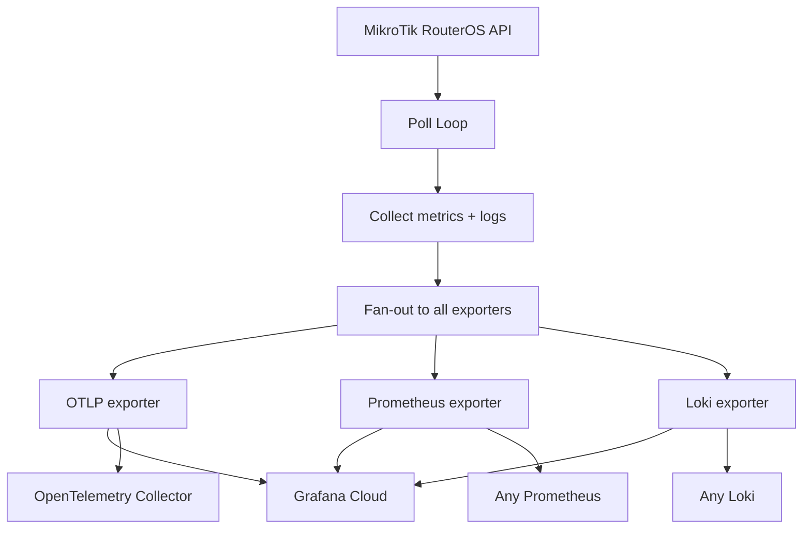

# TikTelemetry

[](https://github.com/jutaz/tiktelemetry/actions/workflows/ci.yml)

A lightweight Go agent that pulls metrics and logs from MikroTik RouterOS via its binary API and pushes them directly to one or more telemetry backends — OTLP/HTTP, Prometheus remote_write, Loki, or any combination. Runs on ARM32/ARM64/AMD64 in a ~14 MB static scratch container with <30 MB RSS. No Prometheus, no Alloy, no Promtail middleman.

---

## Why

MikroTik speaks RouterOS API and Syslog. Grafana Cloud (or any observability backend) speaks OTLP, Prometheus, and Loki. Bridging them traditionally requires a multi-agent pipeline:

|                        | Standard approach                  | TikTelemetry                |
|------------------------|------------------------------------|-----------------------------|
| **Data flow**          | pull + scrape                      | direct push                 |
| **Middleman**          | mikrotik-exporter → Prometheus → Alloy/Promtail | none         |
| **Protocol**           | Prometheus text                    | OTLP / Prometheus remote_write / Loki JSON |
| **Memory footprint**   | ~200 MB+                           | <30 MB                       |
| **Config**             | multiple YAML files                | environment variables only  |

TikTelemetry eliminates every hop between your router and the dashboard. A single static binary handles both metrics and logs, fanning them out to every backend you configure.

---

## How it works



The agent runs a continuous scrape loop. On each tick it queries RouterOS `/system/resource/print`, `/interface/print`, and `/log/print` via the binary API. Metrics and logs are collected once, then fanned out to every enabled exporter. The connection to the router is resilient — it reconnects automatically on the next tick after any failure, so a transient router or network outage never tears the agent down.

---

## Features

- **Multi-arch static image** — `linux/amd64`, `linux/arm64`, `linux/arm/v7` in a single manifest
- **Scratch container** — ~14 MB binary, no BusyBox, no Alpine, no CVEs from system packages
- **Metrics + logs** — both from a single binary
- **Composable exporters** — enable one or more backends (OTLP, Prometheus, Loki) simultaneously; data is collected once and fanned out
- **Env-var only config** — no config files, no YAML, no templating
- **Resilient** — automatic reconnect with backoff on RouterOS or network failures
- **GOMEMLIMIT-bounded** — soft memory ceiling keeps RSS predictable on constrained hardware

---

## Exporters

TikTelemetry uses a composable exporter model. Set `EXPORTERS` to a comma-separated list of the exporters you want — multiple can run at once.

| Exporter         | Signals           | Protocol                           | Use case                                         |
|------------------|-------------------|------------------------------------|--------------------------------------------------|
| `otlp`           | metrics + logs    | OTLP/HTTP (protobuf)               | Universal — Grafana Cloud OTLP gateway, OTel Collector, any OTLP receiver |
| `prometheus`     | metrics           | Prometheus remote_write (snappy)   | Native Grafana Cloud Mimir / any Prometheus remote_write |
| `loki`           | logs              | Loki JSON push API                 | Native Grafana Cloud Loki / any Loki             |
| `grafanacloud`   | metrics + logs    | alias for `prometheus,loki`        | **Recommended** for Grafana Cloud — most efficient native path |

When `grafanacloud` is used, metrics go via Prometheus remote_write and logs via the Loki push API — no OTLP translation on the Grafana Cloud ingest side. This is the most resource-efficient path.

The `otlp` exporter is universal: it works with any OTLP/HTTP backend including Grafana Cloud's OTLP gateway and local OpenTelemetry Collectors. It handles both signals over a single connection.

You can combine exporters freely, e.g. `EXPORTERS=otlp,loki` pushes to an OTLP backend and Loki simultaneously.

---

## Quick start

### 1. Create a RouterOS API user

Upload and run [`scripts/routeros-setup.rsc`](scripts/routeros-setup.rsc) on your MikroTik router:

```
/import routeros-setup.rsc
```

Or manually (after reviewing the script):

```
/user group add name=telemetry policy=api,read,test
/user add name=tiktelemetry group=telemetry password="CHANGE_ME"
/ip service set api disabled=no
```

### 2. Configure the agent (Grafana Cloud native — recommended)

```bash
cp .env.example .env
```

Edit `.env` with your Grafana Cloud credentials and router details:

```bash
EXPORTERS=grafanacloud
ROUTER_ADDRESS=192.168.88.1:8728
ROUTER_USER=tiktelemetry
ROUTER_PASS="CHANGE_ME"

PROMETHEUS_ENDPOINT=https://prometheus-prod-42-prod-us-east-0.grafana.net/api/prom/push
PROMETHEUS_USER=12345
PROMETHEUS_PASS=glc_xxxxxx

LOKI_ENDPOINT=https://logs-prod-012.grafana.net
LOKI_USER=67890
LOKI_PASS=glc_xxxxxx
```

### 3. Run with Docker Compose

Use the provided template as your compose file (or copy it):

```bash
cp docker-compose.example.yml docker-compose.yml
docker compose up -d
```

Or point compose at the template directly without copying:

```bash
docker compose -f docker-compose.example.yml up -d
```

### 4. Or run directly

```bash
docker run -d --restart unless-stopped --name tiktelemetry \
  -e EXPORTERS=grafanacloud \
  -e ROUTER_ADDRESS=192.168.88.1:8728 \
  -e ROUTER_USER=tiktelemetry \
  -e ROUTER_PASS="CHANGE_ME" \
  -e PROMETHEUS_ENDPOINT=https://prometheus-prod-42-prod-us-east-0.grafana.net/api/prom/push \
  -e PROMETHEUS_USER=12345 \
  -e PROMETHEUS_PASS=glc_xxxxxx \
  -e LOKI_ENDPOINT=https://logs-prod-012.grafana.net \
  -e LOKI_USER=67890 \
  -e LOKI_PASS=glc_xxxxxx \
  --memory 64m \
  ghcr.io/jutaz/tiktelemetry:latest
```

To point at a local OpenTelemetry Collector instead, set `EXPORTERS=otlp` with `OTLP_ENDPOINT=http://collector:4318` and `OTLP_INSECURE=true`.

### 5. Verify the configuration

Before (or after) starting, run the built-in preflight check. It connects to the router API and every exporter endpoint read-only, then prints a clear pass/fail report:

```bash
docker run --rm --env-file .env ghcr.io/jutaz/tiktelemetry:latest --check
```

```
tiktelemetry v1.0.0 — preflight check

[PASS] router-api             connected to 192.168.88.1:8728 — board "RB4011iGS+", RouterOS "7.21.5 (stable)", arch "arm64"
[PASS] exporter:prometheus    reachable — TLS handshake OK to prometheus-prod-42-prod-us-east-0.grafana.net:443
[PASS] exporter:loki          reachable — TLS handshake OK to logs-prod-012.grafana.net:443

All checks passed. The agent should run cleanly with this configuration.
```

It reports the router's architecture, so you can confirm you built the right image for on-router deployment, and it surfaces the usual failures (API allow-list, missing DNS, an untrusted CA or wrong clock) with a specific hint.

> **Running on the router itself?** See [Running on RouterOS](#running-on-routeros) for the on-device container deployment (no separate server needed).

---

## Configuration

All configuration is via environment variables. Copy `.env.example` to `.env` and fill in.

### General

| Variable          | Required | Default               | Description                                  |
|-------------------|----------|-----------------------|----------------------------------------------|
| `EXPORTERS`       | no       | `otlp`                | Comma-separated list: `otlp`, `prometheus`, `loki`, or alias `grafanacloud` |
| `COLLECTORS`      | no       | *(all)*               | Comma-separated subset of collectors to run: `system`, `interface`, `health`, `dhcp`, `connections`, `counts`, `firewall`, `wireless`, `wireguard`, `ipsec`, `ppp`, `queue`. Empty = all. |
| `POLL_INTERVAL`   | no       | `15s`                 | Scrape interval (Go duration format)         |
| `SERVICE_NAME`    | no       | `tiktelemetry`        | Resource attribute / label                   |
| `SERVICE_VERSION` | no       | `dev`                 | Resource attribute / label                   |
| `INSTANCE_ID`     | no       | *(router address)*    | `service.instance.id` / `instance` label     |
| `LOG_LEVEL`       | no       | `info`                | Agent log level: `debug`, `info`, `warn`, `error` |
| `GOMEMLIMIT`      | no       | —                     | Go runtime soft memory ceiling (e.g. `24MiB`)|

### Router

| Variable              | Required | Default               | Description                              |
|-----------------------|----------|-----------------------|------------------------------------------|
| `ROUTER_ADDRESS`      | no       | `192.168.88.1:8728`   | RouterOS API host:port                   |
| `ROUTER_USER`         | no       | `admin`               | RouterOS API user                        |
| `ROUTER_PASS`         | **yes**  | *(no default)*        | RouterOS API password                    |
| `ROUTER_TLS`          | no       | `false`               | Use API-SSL (port typically 8729)        |
| `ROUTER_TLS_INSECURE` | no       | `false`               | Skip TLS cert verification               |
| `ROUTER_DIAL_TIMEOUT` | no       | `5s`                  | Dial timeout (Go duration format)        |
| `ROUTER_MAX_REPLY_ROWS` | no     | `10000`               | Max rows processed per RouterOS reply (bounds memory from a hostile/large reply; `0` = unlimited) |

### OTLP exporter (only used when `otlp` in `EXPORTERS`)

| Variable           | Required | Default | Description                                              |
|--------------------|----------|---------|----------------------------------------------------------|
| `OTLP_ENDPOINT`    | **yes*** | —       | Full base URL (e.g. `https://.../otlp`). App appends `/v1/metrics` and `/v1/logs`. |
| `OTLP_HEADERS`     | no       | —       | Comma-separated `key=value` extra HTTP headers           |
| `OTLP_BEARER_TOKEN`| no       | —       | Sets `Authorization: Bearer <token>`                     |
| `OTLP_USER`        | no       | —       | Basic auth username (Grafana Cloud: numeric instance ID) |
| `OTLP_PASS`        | no       | —       | Basic auth password (Grafana Cloud: access policy token) |
| `OTLP_INSECURE`    | no       | `false` | Allow plain HTTP (no TLS)                                |

\* Required when the `otlp` exporter is enabled.

### Prometheus exporter (only used when `prometheus` in `EXPORTERS`)

| Variable                       | Required | Default | Description                                              |
|--------------------------------|----------|---------|----------------------------------------------------------|
| `PROMETHEUS_ENDPOINT`          | **yes*** | —       | Prometheus remote_write URL (e.g. `https://.../api/prom/push`) |
| `PROMETHEUS_USER`              | no       | —       | Basic auth username (Grafana Cloud: Metrics instance ID) |
| `PROMETHEUS_PASS`              | no       | —       | Basic auth password (Grafana Cloud: access policy token with `metrics:write`) |
| `PROMETHEUS_HEADERS`           | no       | —       | Comma-separated `key=value` extra headers                |
| `PROMETHEUS_INSECURE_SKIP_VERIFY` | no   | `false` | Skip TLS certificate verification (self-hosted)          |

\* Required when the `prometheus` exporter is enabled.

### Loki exporter (only used when `loki` in `EXPORTERS`)

| Variable                   | Required | Default | Description                                              |
|----------------------------|----------|---------|----------------------------------------------------------|
| `LOKI_ENDPOINT`            | **yes*** | —       | Base URL (e.g. `https://logs-prod-012.grafana.net`). App appends `/loki/api/v1/push`; full path accepted. |
| `LOKI_USER`                | no       | —       | Basic auth username (Grafana Cloud: Logs instance ID)    |
| `LOKI_PASS`                | no       | —       | Basic auth password (Grafana Cloud: access policy token with `logs:write`) |
| `LOKI_HEADERS`             | no       | —       | Comma-separated `key=value` extra headers                |
| `LOKI_INSECURE_SKIP_VERIFY`| no       | `false` | Skip TLS certificate verification                        |

\* Required when the `loki` exporter is enabled.

---

## Metrics

All metrics are collected from the RouterOS API and pushed to every enabled exporter that handles metrics.

### Collectors

TikTelemetry groups metric collection into individual collectors controlled by the `COLLECTORS` env var. When unset, all collectors run.

| Collector      | What it collects                                           | RouterOS source(s)                                           | Notes |
|----------------|------------------------------------------------------------|--------------------------------------------------------------|-------|
| `system`       | CPU load, memory, disk, uptime                             | `/system/resource/print`                                     | Always available |
| `interface`    | Interface bytes, packets, up status                        | `/interface/print`                                            | Always available |
| `health`       | Temperature, voltage, fan speed, power                     | `/system/health/print`                                       | Hardware sensors; empty on CHR |
| `dhcp`         | DHCP lease counts                                          | `/ip/dhcp-server/lease/print`                                | Empty aggregate when no DHCP server |
| `connections`  | Firewall connection tracking counts                        | `/ip/firewall/connection/tracking/print`                     | Available on CHR |
| `counts`       | IP address and route counts                                | `/ip/address/print`, `/ip/route/print`                       | Available on CHR |
| `firewall`     | Filter rule cumulative bytes and packets                   | `/ip/firewall/filter/print`                                  | Empty on default CHR with no rules |
| `wireless`     | Connected wireless clients per radio                       | `/interface/wireless/registration-table/print` or `/interface/wifi/registration-table/print` | Hardware radios only; returns nothing on CHR |
| `wireguard`    | Per-peer rx/tx bytes and last-handshake age                | `/interface/wireguard/peers/print`                           | Empty when no peers configured |
| `ipsec`        | Per-peer rx/tx bytes and packets, active-peer count        | `/ip/ipsec/active-peers/print`                               | Empty aggregate when no tunnels |
| `ppp`          | Active PPP/PPPoE/L2TP session counts by service            | `/ppp/active/print`                                          | Empty aggregate when no sessions |
| `queue`        | Per-queue tx/rx bytes, packets, and drops                  | `/queue/simple/print` (`=stats=`)                            | Empty when no simple queues |

Collectors targeting hardware or features not present on the device (health sensors on CHR, wireless without a radio, firewall rules / DHCP leases / VPN peers / queues when unconfigured) simply emit zero series and never fail the scrape — this resilience is by design.

### Gauges

| Metric name                        | Unit   | Attributes          | Description                                |
|-----------------------------------|--------|---------------------|--------------------------------------------|
| `mikrotik.system.cpu.load`         | %      | —                   | CPU load percentage                        |
| `mikrotik.system.memory.free`      | By     | —                   | Available memory                           |
| `mikrotik.system.memory.total`     | By     | —                   | Total memory                               |
| `mikrotik.system.hdd.free`         | By     | —                   | Free disk space                            |
| `mikrotik.interface.up`            | 1      | `interface`, `type` | Interface operational status (1 = up)      |
| `mikrotik.system.health`           | varies | `sensor`            | Hardware sensor reading (Cel, V, A, W, 1). One series per sensor |
| `mikrotik.dhcp.leases`             | 1      | `server`, `status`  | DHCP leases per server and status          |
| `mikrotik.dhcp.leases.total`       | 1      | —                   | Total DHCP leases (always emitted, even 0) |
| `mikrotik.connections.active`      | 1      | —                   | Currently tracked firewall connections     |
| `mikrotik.connections.max`         | 1      | —                   | Maximum tracked connection capacity        |
| `mikrotik.ip.addresses`            | 1      | —                   | Number of configured IP addresses          |
| `mikrotik.ip.routes`               | 1      | —                   | Number of routes in the routing table      |
| `mikrotik.wireless.clients`        | 1      | `interface`         | Connected wireless clients per radio       |
| `mikrotik.wireguard.last_handshake`| s      | `interface`, `comment` (*) | Seconds since the last WireGuard handshake |
| `mikrotik.ipsec.active_peers`      | 1      | —                   | Number of established IPsec peers (always emitted) |
| `mikrotik.ppp.sessions`            | 1      | `service`           | Active PPP sessions per service type       |
| `mikrotik.ppp.sessions.total`      | 1      | —                   | Total active PPP sessions (always emitted) |

### Counters (cumulative)

| Metric name                           | Unit | Attributes                          | Description                              |
|---------------------------------------|------|-------------------------------------|------------------------------------------|
| `mikrotik.system.uptime`              | s    | —                                   | System uptime                            |
| `mikrotik.interface.rx.bytes`         | By   | `interface`, `type`                 | Bytes received on interface              |
| `mikrotik.interface.tx.bytes`         | By   | `interface`, `type`                 | Bytes transmitted on interface           |
| `mikrotik.interface.rx.packets`       | 1    | `interface`, `type`                 | Packets received on interface            |
| `mikrotik.interface.tx.packets`       | 1    | `interface`, `type`                 | Packets transmitted on interface         |
| `mikrotik.interface.rx.errors`        | 1    | `interface`, `type`                 | Receive errors on interface              |
| `mikrotik.interface.tx.errors`        | 1    | `interface`, `type`                 | Transmit errors on interface             |
| `mikrotik.interface.rx.drops`         | 1    | `interface`, `type`                 | Received packets dropped on interface    |
| `mikrotik.interface.tx.drops`         | 1    | `interface`, `type`                 | Transmitted packets dropped on interface |
| `mikrotik.interface.link_downs`       | 1    | `interface`, `type`                 | Times the interface link went down       |
| `mikrotik.firewall.filter.bytes`      | By   | `chain`, `action`, `comment` (*)    | Cumulative bytes per firewall rule       |
| `mikrotik.firewall.filter.packets`    | 1    | `chain`, `action`, `comment` (*)    | Cumulative packets per firewall rule     |
| `mikrotik.wireguard.rx.bytes`         | By   | `interface`, `comment` (*)          | Bytes received from a WireGuard peer     |
| `mikrotik.wireguard.tx.bytes`         | By   | `interface`, `comment` (*)          | Bytes sent to a WireGuard peer           |
| `mikrotik.ipsec.rx.bytes`             | By   | `remote`                            | Bytes received over an IPsec peer        |
| `mikrotik.ipsec.tx.bytes`             | By   | `remote`                            | Bytes sent over an IPsec peer            |
| `mikrotik.ipsec.rx.packets`           | 1    | `remote`                            | Packets received over an IPsec peer      |
| `mikrotik.ipsec.tx.packets`           | 1    | `remote`                            | Packets sent over an IPsec peer          |
| `mikrotik.queue.tx.bytes` / `.rx.bytes`     | By | `queue`                       | Bytes sent/received through a simple queue |
| `mikrotik.queue.tx.packets` / `.rx.packets` | 1  | `queue`                       | Packets sent/received through a simple queue |
| `mikrotik.queue.tx.dropped` / `.rx.dropped` | 1  | `queue`                       | Packets dropped by a simple queue        |

Interface metrics carry two resource attributes:
- `interface` — the interface name (e.g. `ether1`, `wlan1`)
- `type` — the interface type (e.g. `ether`, `wlan`, `bridge`)

Firewall metrics carry:
- `chain` — the firewall chain (e.g. `forward`, `input`)
- `action` — the rule action (e.g. `accept`, `drop`)
- `comment` — the rule comment label; **only present when the rule has a comment**

### Exporter-specific notes

- **OTLP exporter** — metric names are sent as-is using dot-separated namespacing (`mikrotik.system.cpu.load`). Counters use delta temporality.
- **Prometheus exporter** — metric names are sanitized to underscores (`mikrotik_system_cpu_load`). The exporter adds `service` and `instance` labels. Counters are sent as absolute cumulative values — use `rate()` in PromQL.

---

## Logs

The agent tails RouterOS logs via `/log/print` on each poll cycle and pushes them to every enabled exporter that handles logs.

### Severity mapping

| RouterOS topic tag                                    | OTLP severity      |
|-------------------------------------------------------|--------------------|
| `critical`                                            | Fatal              |
| `error`                                               | Error              |
| `warning`                                             | Warn               |
| `debug`                                               | Debug              |
| everything else (info, system, admin, etc.)           | Info               |

### Exporter-specific notes

- **OTLP exporter** — logs are sent as OTLP log records with severity and attributes.
- **Loki exporter** — logs are pushed as JSON streams with labels `service`, `source=mikrotik`, `level`, and `instance`. RouterOS topics and the message ID are included as structured metadata.

### Timestamps

RouterOS `/log/print` reports each entry's time as a wall clock that usually omits the year (e.g. `15:04:05` or `jan/02 15:04:05`). The agent reads the router's own clock and timezone (`/system/clock/print`, including `gmt-offset`) once per poll and uses it to resolve each entry to an absolute, timezone-correct timestamp — so logs land at the right moment in Loki or your OTLP backend regardless of where the agent runs. Entries whose time cannot be parsed, or when the router clock is unavailable, fall back to the collection time.

---

## Grafana Cloud setup

TikTelemetry supports two paths into Grafana Cloud. The **native path** (`grafanacloud` alias) is recommended; the **OTLP path** is the universal alternative.

### Native path (recommended) — Prometheus + Loki

1. **Find your Prometheus remote_write URL** — in Grafana Cloud, go to **Connections → Add new connection → Prometheus**. Copy the remote_write endpoint (e.g. `https://prometheus-prod-42-prod-us-east-0.grafana.net/api/prom/push`). Note the numeric **Metrics instance ID** from the URL.

2. **Find your Loki push URL** — **Connections → Add new connection → Loki**. Copy the base URL (e.g. `https://logs-prod-012.grafana.net`). Note the numeric **Logs instance ID**.

3. **Create an access policy** — **Administration → Access Policies → Create access policy**:
   - Name: `tiktelemetry`
   - Scope: `metrics:write`, `logs:write`
   - Create a token and copy it.

4. Set the env vars:
   ```
   EXPORTERS=grafanacloud
   PROMETHEUS_ENDPOINT=https://prometheus-prod-42-prod-us-east-0.grafana.net/api/prom/push
   PROMETHEUS_USER=<metrics-instance-id>
   PROMETHEUS_PASS=<access-policy-token>
   LOKI_ENDPOINT=https://logs-prod-012.grafana.net
   LOKI_USER=<logs-instance-id>
   LOKI_PASS=<access-policy-token>
   ```

   The same access policy token can be used for both Prometheus and Loki if the policy has both `metrics:write` and `logs:write` scopes.

### OTLP path (alternative)

1. Find your **OTLP endpoint** — **Connections → Add new connection → OpenTelemetry**. Copy the OTLP URL (e.g. `https://otlp-gateway-prod-us-east-0.grafana.net/otlp`).

2. Your **instance ID** — the numeric tenant ID in the OTLP URL path (also visible in **My Account → Organization → ID**).

3. Create an access policy with `metrics:write` and `logs:write` (same as above).

4. Set the env vars:
   ```
   EXPORTERS=otlp
   OTLP_ENDPOINT=https://otlp-gateway-prod-us-east-0.grafana.net/otlp
   OTLP_USER=<numeric-instance-id>
   OTLP_PASS=<access-policy-token>
   ```

---

## Building from source

### Local build

```bash
go build -ldflags="-s -w" -o tiktelemetry ./cmd/tiktelemetry
```

### Cross-compile for ARM

```bash
# ARMv7 (32-bit)
CGO_ENABLED=0 GOOS=linux GOARCH=arm GOARM=7 \
  go build -ldflags="-s -w" -o tiktelemetry-armv7 ./cmd/tiktelemetry

# ARM64
CGO_ENABLED=0 GOOS=linux GOARCH=arm64 \
  go build -ldflags="-s -w" -o tiktelemetry-arm64 ./cmd/tiktelemetry
```

### Multi-arch Docker image (buildx)

```bash
docker buildx build \
  --platform linux/amd64,linux/arm64,linux/arm/v7 \
  -t youruser/tiktelemetry:latest --push .
```

The Dockerfile uses a two-stage scratch build with automatic `GOARM` derivation from buildx's `TARGETVARIANT`.

---

## Testing

Unit tests cover configuration, the collectors, the export adapters (with in-test protobuf/JSON decoding), and the fan-out logic. They need no network or Docker:

```sh
make test        # go test ./... -count=1
make test-race   # with the race detector
make cover       # per-package coverage
```

End-to-end tests exercise the real collectors and the full collect-and-push pipeline against an actual MikroTik RouterOS (Cloud Hosted Router) instance. They are gated behind the `e2e` build tag, so `go test ./...` never touches Docker, and the `testcontainers-go` dependency never links into the production binary.

```sh
# Lets testcontainers start and tear down the RouterOS container (needs Docker):
make test-e2e

# Or run against a long-lived instance:
make e2e-up
ROUTEROS_ADDR=127.0.0.1:8728 go test -tags e2e -count=1 -v ./test/e2e/...
make e2e-down
```

The harness waits for the RouterOS API to accept a login (not just for the TCP port to open) before running. CHR boots in roughly 30-60s under software emulation, faster with KVM. In CI, the e2e job enables `/dev/kvm` for acceleration.

---

## Running on RouterOS

Because the image is a ~14 MB static binary, it runs comfortably in RouterOS v7's built-in `container` feature — no separate server needed. This is the recommended deployment for a single router.

RouterOS containers are minimal (no compose, no healthchecks, spartan networking), so the steps below are explicit. Two helper scripts and a built-in preflight check do the heavy lifting:

- [`scripts/routeros-setup.rsc`](scripts/routeros-setup.rsc) — creates a least-privilege API user.
- [`scripts/container-setup.rsc`](scripts/container-setup.rsc) — sets up the bridge/veth networking, environment, and container. Fully commented; read and edit it before running.
- `tiktelemetry --check` — a read-only preflight that verifies the router API and every exporter endpoint are reachable, and prints exactly what is wrong if not.

### Prerequisites

1. **A supported architecture.** Containers run on `arm`, `arm64`, and `x86` boards only (not `mipsbe`/`smips`). Check with `/system/resource/print` and match the image:

   | RouterOS `architecture-name` | Image / tarball arch |
   |------------------------------|----------------------|
   | `arm`                        | `arm` (linux/arm/v7) |
   | `arm64`                      | `arm64`              |
   | `x86_64`                     | `amd64`              |

   A wrong-architecture image will fail to start, often without a clear error — this is the #1 gotcha.

2. **The `container` package**, installed for your architecture and the router rebooted. It ships in the "extra packages" archive on the MikroTik download page (it is *not* in the main package). On RouterOS 7.18+ apply it with `/system/package/apply-changes`; on older versions a normal reboot is correct. Verify with `/container/config/print`.

3. **Containers enabled in device-mode.** They are off by default and enabling them is gated by a **physical** confirmation for security:
   ```
   /system/device-mode/update container=yes
   ```
   Within ~5 minutes you must confirm physically: press the **reset button** on a RouterBOARD, or **cold power-cycle** an x86/CHR host (a soft `/system/reboot` does *not* count). Verify afterwards with `/system/device-mode/print` showing `container: yes`.

4. **External storage** (USB / SATA / NVMe, formatted ext4). Container layers should not live on the tiny internal flash. Budget ~500 MB. Find your device name with `/disk/print` and adjust the `disk1` paths in the setup script.

### Deploy

1. **Create the API user** — run [`scripts/routeros-setup.rsc`](scripts/routeros-setup.rsc) (set a real password).

2. **Get the image onto the router.** Offline import is the most reliable path (it needs no registry login, which is the usual failure point):
   ```sh
   make image-tar ARCH=arm64      # or arm / amd64 to match the board
   ```
   or download the matching `tiktelemetry-<version>-<arch>.tar.gz` from the [Releases](https://github.com/jutaz/tiktelemetry/releases) page and `gunzip` it. Upload the `.tar` to the router's external storage (WinBox Files drag-and-drop, or `scp`).

   Alternatively, pull from GHCR by setting `/container/config` credentials (a GitHub token with `read:packages`) — see the script.

3. **Configure and create the container** — review and edit [`scripts/container-setup.rsc`](scripts/container-setup.rsc) (subnet, storage device, exporter settings, secrets), then apply it section by section. It:
   - creates a `containers` bridge and a `veth-tik` interface (gateway `172.17.0.1`, container `172.17.0.2`);
   - adds a masquerade rule and sets `/ip/dns` so the outbound HTTPS push works (**DNS is required — the container will not start without it**);
   - restricts the API service to the container subnet;
   - sets the environment (pointing `ROUTER_ADDRESS` at `172.17.0.1:8728` — the veth gateway, **not** `127.0.0.1`, which is the container's own loopback);
   - creates the container with `logging=yes` and `start-on-boot=yes`.

4. **Start it and watch the log:**
   ```
   /container/print
   /container/start 0
   /log/print where topics~"container"
   ```
   The image is `scratch` (no shell), so `/container/shell` will not work — the RouterOS log is where the agent's JSON output appears.

### Verifying and troubleshooting

Run the preflight as a one-shot container to see exactly what works:

```
/container/add file=disk1/tiktelemetry.tar interface=veth-tik \
    root-dir=disk1/tik-check envlist=tik cmd="/tiktelemetry --check" logging=yes
/container/start <number>
/log/print where topics~"container"
```

It reports the router board/version/architecture it reached and whether each exporter endpoint passes DNS + TCP + TLS, with a specific hint for each failure. Common issues: architecture mismatch, device-mode not enabled, DNS not configured, a wrong Grafana Cloud token, or the API allow-list excluding the container subnet.

> **Security note:** RouterOS stores container environment variables — including `ROUTER_PASS` and your Grafana tokens — in **plaintext** in the config export. Treat the router configuration as sensitive, and use a least-privilege API user (the setup script creates a read-only one).

---

## Extending: add your own exporter

The exporter system is designed to be easy to extend. To add a new backend:

1. **Implement the [`Sink`](internal/export/sink.go#sym:type:Sink) interface** in a new package `internal/export/<name>/`. The interface requires five methods:

   ```go
   type Sink interface {
       Name() string
       Capabilities() Capabilities   // Metrics and/or Logs
       ConsumeMetrics(ctx context.Context, samples []model.Sample) error
       ConsumeLogs(ctx context.Context, entries []model.LogEntry) error
       Shutdown(ctx context.Context) error
   }
   ```

   Implement the `Consume*` methods you need; leave the other as a no-op returning `nil`.

2. **Register your factory** in the package's `init()` with [`Register`](internal/export/sink.go#sym:fn:Register):

   ```go
   func init() {
       export.Register("mybackend", New)
   }
   ```

3. **Add a blank import** in `internal/exporters/exporters.go`:

   ```go
   _ "github.com/jutaz/tiktelemetry/internal/export/mybackend"
   ```

The agent collects each signal once per scrape and fans it out to every enabled sink through the [`MultiSink`](internal/export/multi.go#sym:type:MultiSink).

That's it. Users can now enable your backend via `EXPORTERS=mybackend`. No other file needs to change.

---

## License

MIT License — see [LICENSE](LICENSE). Copyright (c) 2026 jutaz.
