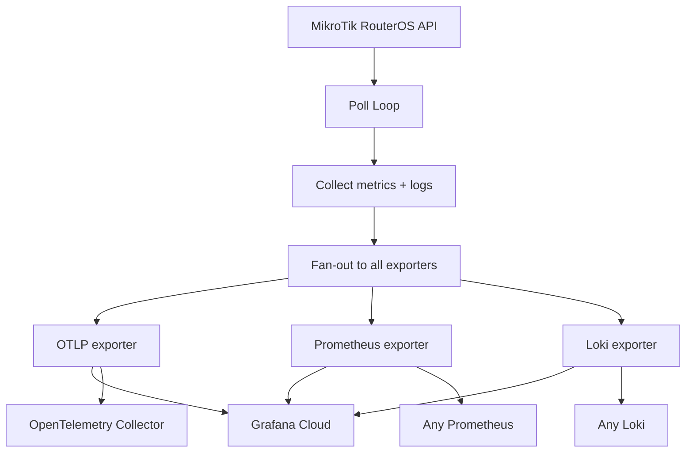

# TikTelemetry

A lightweight Go agent that pulls metrics and logs from MikroTik RouterOS via its binary API and pushes them directly to one or more telemetry backends — OTLP/HTTP, Prometheus remote_write, Loki, or any combination. Runs on ARM32/ARM64/AMD64 in a ~14 MB static scratch container with <30 MB RSS. No Prometheus, no Alloy, no Promtail middleman.

---

## Why

MikroTik speaks RouterOS API and Syslog. Grafana Cloud (or any observability backend) speaks OTLP, Prometheus, and Loki. Bridging them traditionally requires a multi-agent pipeline:

|                        | Standard approach                  | TikTelemetry                |
|------------------------|------------------------------------|-----------------------------|
| **Data flow**          | pull + scrape                      | direct push                 |
| **Middleman**          | mikrotik-exporter → Prometheus → Alloy/Promtail | none         |
| **Protocol**           | Prometheus text                    | OTLP / Prometheus remote_write / Loki JSON |
| **Memory footprint**   | ~200 MB+                           | <30 MB                       |
| **Config**             | multiple YAML files                | environment variables only  |

TikTelemetry eliminates every hop between your router and the dashboard. A single static binary handles both metrics and logs, fanning them out to every backend you configure.

---

## How it works



The agent runs a continuous scrape loop. On each tick it queries RouterOS `/system/resource/print`, `/interface/print`, and `/log/print` via the binary API. Metrics and logs are collected once, then fanned out to every enabled exporter. The connection to the router is resilient — it reconnects automatically on the next tick after any failure, so a transient router or network outage never tears the agent down.

---

## Features

- **Multi-arch static image** — `linux/amd64`, `linux/arm64`, `linux/arm/v7` in a single manifest
- **Scratch container** — ~14 MB binary, no BusyBox, no Alpine, no CVEs from system packages
- **Metrics + logs** — both from a single binary
- **Composable exporters** — enable one or more backends (OTLP, Prometheus, Loki) simultaneously; data is collected once and fanned out
- **Env-var only config** — no config files, no YAML, no templating
- **Resilient** — automatic reconnect with backoff on RouterOS or network failures
- **GOMEMLIMIT-bounded** — soft memory ceiling keeps RSS predictable on constrained hardware

---

## Exporters

TikTelemetry uses a composable exporter model. Set `EXPORTERS` to a comma-separated list of the exporters you want — multiple can run at once.

| Exporter         | Signals           | Protocol                           | Use case                                         |
|------------------|-------------------|------------------------------------|--------------------------------------------------|
| `otlp`           | metrics + logs    | OTLP/HTTP (protobuf)               | Universal — Grafana Cloud OTLP gateway, OTel Collector, any OTLP receiver |
| `prometheus`     | metrics           | Prometheus remote_write (snappy)   | Native Grafana Cloud Mimir / any Prometheus remote_write |
| `loki`           | logs              | Loki JSON push API                 | Native Grafana Cloud Loki / any Loki             |
| `grafanacloud`   | metrics + logs    | alias for `prometheus,loki`        | **Recommended** for Grafana Cloud — most efficient native path |

When `grafanacloud` is used, metrics go via Prometheus remote_write and logs via the Loki push API — no OTLP translation on the Grafana Cloud ingest side. This is the most resource-efficient path.

The `otlp` exporter is universal: it works with any OTLP/HTTP backend including Grafana Cloud's OTLP gateway and local OpenTelemetry Collectors. It handles both signals over a single connection.

You can combine exporters freely, e.g. `EXPORTERS=otlp,loki` pushes to an OTLP backend and Loki simultaneously.

---

## Quick start

### 1. Create a RouterOS API user

Run the setup script on your MikroTik router:

```
/import tiktelemetry-setup.rsc
```

Or manually (after reviewing `scripts/routeros-setup.rsc`):

```
/user group add name=telemetry policy=api,read,test
/user add name=tiktelemetry group=telemetry password="CHANGE_ME"
/ip service set api disabled=no
```

### 2. Configure the agent (Grafana Cloud native — recommended)

```bash
cp .env.example .env
```

Edit `.env` with your Grafana Cloud credentials and router details:

```bash
EXPORTERS=grafanacloud
ROUTER_ADDRESS=192.168.88.1:8728
ROUTER_USER=tiktelemetry
ROUTER_PASS="CHANGE_ME"

PROMETHEUS_ENDPOINT=https://prometheus-prod-42-prod-us-east-0.grafana.net/api/prom/push
PROMETHEUS_USER=12345
PROMETHEUS_PASS=glc_xxxxxx

LOKI_ENDPOINT=https://logs-prod-012.grafana.net
LOKI_USER=67890
LOKI_PASS=glc_xxxxxx
```

### 3. Run with Docker Compose

```bash
docker compose up -d
```

### 4. Or run directly

```bash
docker run -d --restart unless-stopped --name tiktelemetry \
  -e EXPORTERS=grafanacloud \
  -e ROUTER_ADDRESS=192.168.88.1:8728 \
  -e ROUTER_USER=tiktelemetry \
  -e ROUTER_PASS="CHANGE_ME" \
  -e PROMETHEUS_ENDPOINT=https://prometheus-prod-42-prod-us-east-0.grafana.net/api/prom/push \
  -e PROMETHEUS_USER=12345 \
  -e PROMETHEUS_PASS=glc_xxxxxx \
  -e LOKI_ENDPOINT=https://logs-prod-012.grafana.net \
  -e LOKI_USER=67890 \
  -e LOKI_PASS=glc_xxxxxx \
  --memory 64m \
  ghcr.io/jutaz/tiktelemetry:latest
```

To point at a local OpenTelemetry Collector instead, set `EXPORTERS=otlp` with `OTLP_ENDPOINT=http://collector:4318` and `OTLP_INSECURE=true`.

---

## Configuration

All configuration is via environment variables. Copy `.env.example` to `.env` and fill in.

### General

| Variable          | Required | Default               | Description                                  |
|-------------------|----------|-----------------------|----------------------------------------------|
| `EXPORTERS`       | no       | `otlp`                | Comma-separated list: `otlp`, `prometheus`, `loki`, or alias `grafanacloud` |
| `POLL_INTERVAL`   | no       | `15s`                 | Scrape interval (Go duration format)         |
| `SERVICE_NAME`    | no       | `tiktelemetry`        | Resource attribute / label                   |
| `SERVICE_VERSION` | no       | `dev`                 | Resource attribute / label                   |
| `INSTANCE_ID`     | no       | *(router address)*    | `service.instance.id` / `instance` label     |
| `LOG_LEVEL`       | no       | `info`                | Agent log level: `debug`, `info`, `warn`, `error` |
| `GOMEMLIMIT`      | no       | —                     | Go runtime soft memory ceiling (e.g. `24MiB`)|

### Router

| Variable              | Required | Default               | Description                              |
|-----------------------|----------|-----------------------|------------------------------------------|
| `ROUTER_ADDRESS`      | no       | `192.168.88.1:8728`   | RouterOS API host:port                   |
| `ROUTER_USER`         | no       | `admin`               | RouterOS API user                        |
| `ROUTER_PASS`         | **yes**  | *(no default)*        | RouterOS API password                    |
| `ROUTER_TLS`          | no       | `false`               | Use API-SSL (port typically 8729)        |
| `ROUTER_TLS_INSECURE` | no       | `false`               | Skip TLS cert verification               |
| `ROUTER_DIAL_TIMEOUT` | no       | `5s`                  | Dial timeout (Go duration format)        |

### OTLP exporter (only used when `otlp` in `EXPORTERS`)

| Variable           | Required | Default | Description                                              |
|--------------------|----------|---------|----------------------------------------------------------|
| `OTLP_ENDPOINT`    | **yes*** | —       | Full base URL (e.g. `https://.../otlp`). App appends `/v1/metrics` and `/v1/logs`. |
| `OTLP_HEADERS`     | no       | —       | Comma-separated `key=value` extra HTTP headers           |
| `OTLP_BEARER_TOKEN`| no       | —       | Sets `Authorization: Bearer <token>`                     |
| `OTLP_USER`        | no       | —       | Basic auth username (Grafana Cloud: numeric instance ID) |
| `OTLP_PASS`        | no       | —       | Basic auth password (Grafana Cloud: access policy token) |
| `OTLP_INSECURE`    | no       | `false` | Allow plain HTTP (no TLS)                                |

\* Required when the `otlp` exporter is enabled.

### Prometheus exporter (only used when `prometheus` in `EXPORTERS`)

| Variable                       | Required | Default | Description                                              |
|--------------------------------|----------|---------|----------------------------------------------------------|
| `PROMETHEUS_ENDPOINT`          | **yes*** | —       | Prometheus remote_write URL (e.g. `https://.../api/prom/push`) |
| `PROMETHEUS_USER`              | no       | —       | Basic auth username (Grafana Cloud: Metrics instance ID) |
| `PROMETHEUS_PASS`              | no       | —       | Basic auth password (Grafana Cloud: access policy token with `metrics:write`) |
| `PROMETHEUS_HEADERS`           | no       | —       | Comma-separated `key=value` extra headers                |
| `PROMETHEUS_INSECURE_SKIP_VERIFY` | no   | `false` | Skip TLS certificate verification (self-hosted)          |

\* Required when the `prometheus` exporter is enabled.

### Loki exporter (only used when `loki` in `EXPORTERS`)

| Variable                   | Required | Default | Description                                              |
|----------------------------|----------|---------|----------------------------------------------------------|
| `LOKI_ENDPOINT`            | **yes*** | —       | Base URL (e.g. `https://logs-prod-012.grafana.net`). App appends `/loki/api/v1/push`; full path accepted. |
| `LOKI_USER`                | no       | —       | Basic auth username (Grafana Cloud: Logs instance ID)    |
| `LOKI_PASS`                | no       | —       | Basic auth password (Grafana Cloud: access policy token with `logs:write`) |
| `LOKI_HEADERS`             | no       | —       | Comma-separated `key=value` extra headers                |
| `LOKI_INSECURE_SKIP_VERIFY`| no       | `false` | Skip TLS certificate verification                        |

\* Required when the `loki` exporter is enabled.

---

## Metrics

All metrics are collected from the RouterOS API and pushed to every enabled exporter that handles metrics.

### Gauges

| Metric name                     | Unit | Attributes  | Description                     |
|--------------------------------|------|-------------|---------------------------------|
| `mikrotik.system.cpu.load`      | %    | —           | CPU load percentage             |
| `mikrotik.system.memory.free`   | By   | —           | Available memory                |
| `mikrotik.system.memory.total`  | By   | —           | Total memory                    |
| `mikrotik.system.hdd.free`      | By   | —           | Free disk space                 |
| `mikrotik.interface.up`         | 1    | `interface`, `type` | Interface operational status (1 = up) |

### Counters (cumulative)

| Metric name                        | Unit | Attributes     | Description                          |
|------------------------------------|------|----------------|--------------------------------------|
| `mikrotik.system.uptime`           | s    | —              | System uptime                        |
| `mikrotik.interface.rx.bytes`      | By   | `interface`, `type` | Bytes received on interface    |
| `mikrotik.interface.tx.bytes`      | By   | `interface`, `type` | Bytes transmitted on interface |
| `mikrotik.interface.rx.packets`    | 1    | `interface`, `type` | Packets received on interface  |
| `mikrotik.interface.tx.packets`    | 1    | `interface`, `type` | Packets transmitted on interface|

Interface metrics carry two resource attributes:
- `interface` — the interface name (e.g. `ether1`, `wlan1`)
- `type` — the interface type (e.g. `ether`, `wlan`, `bridge`)

### Exporter-specific notes

- **OTLP exporter** — metric names are sent as-is using dot-separated namespacing (`mikrotik.system.cpu.load`). Counters use delta temporality.
- **Prometheus exporter** — metric names are sanitized to underscores (`mikrotik_system_cpu_load`). The exporter adds `service` and `instance` labels. Counters are sent as absolute cumulative values — use `rate()` in PromQL.

---

## Logs

The agent tails RouterOS logs via `/log/print` on each poll cycle and pushes them to every enabled exporter that handles logs.

### Severity mapping

| RouterOS topic tag                                    | OTLP severity      |
|-------------------------------------------------------|--------------------|
| `critical`                                            | Fatal              |
| `error`                                               | Error              |
| `warning`                                             | Warn               |
| `debug`                                               | Debug              |
| everything else (info, system, admin, etc.)           | Info               |

### Exporter-specific notes

- **OTLP exporter** — logs are sent as OTLP log records with severity and attributes.
- **Loki exporter** — logs are pushed as JSON streams with labels `service`, `source=mikrotik`, `level`, and `instance`. RouterOS topics and the message ID are included as structured metadata.

### Known limitation

RouterOS `/log/print` does not provide real timestamps for historical log entries — logs arrive as they are emitted by the router. The agent assigns each log record the collection timestamp rather than the actual event timestamp.

---

## Grafana Cloud setup

TikTelemetry supports two paths into Grafana Cloud. The **native path** (`grafanacloud` alias) is recommended; the **OTLP path** is the universal alternative.

### Native path (recommended) — Prometheus + Loki

1. **Find your Prometheus remote_write URL** — in Grafana Cloud, go to **Connections → Add new connection → Prometheus**. Copy the remote_write endpoint (e.g. `https://prometheus-prod-42-prod-us-east-0.grafana.net/api/prom/push`). Note the numeric **Metrics instance ID** from the URL.

2. **Find your Loki push URL** — **Connections → Add new connection → Loki**. Copy the base URL (e.g. `https://logs-prod-012.grafana.net`). Note the numeric **Logs instance ID**.

3. **Create an access policy** — **Administration → Access Policies → Create access policy**:
   - Name: `tiktelemetry`
   - Scope: `metrics:write`, `logs:write`
   - Create a token and copy it.

4. Set the env vars:
   ```
   EXPORTERS=grafanacloud
   PROMETHEUS_ENDPOINT=https://prometheus-prod-42-prod-us-east-0.grafana.net/api/prom/push
   PROMETHEUS_USER=<metrics-instance-id>
   PROMETHEUS_PASS=<access-policy-token>
   LOKI_ENDPOINT=https://logs-prod-012.grafana.net
   LOKI_USER=<logs-instance-id>
   LOKI_PASS=<access-policy-token>
   ```

   The same access policy token can be used for both Prometheus and Loki if the policy has both `metrics:write` and `logs:write` scopes.

### OTLP path (alternative)

1. Find your **OTLP endpoint** — **Connections → Add new connection → OpenTelemetry**. Copy the OTLP URL (e.g. `https://otlp-gateway-prod-us-east-0.grafana.net/otlp`).

2. Your **instance ID** — the numeric tenant ID in the OTLP URL path (also visible in **My Account → Organization → ID**).

3. Create an access policy with `metrics:write` and `logs:write` (same as above).

4. Set the env vars:
   ```
   EXPORTERS=otlp
   OTLP_ENDPOINT=https://otlp-gateway-prod-us-east-0.grafana.net/otlp
   OTLP_USER=<numeric-instance-id>
   OTLP_PASS=<access-policy-token>
   ```

---

## Building from source

### Local build

```bash
go build -ldflags="-s -w" -o tiktelemetry ./cmd/tiktelemetry
```

### Cross-compile for ARM

```bash
# ARMv7 (32-bit)
CGO_ENABLED=0 GOOS=linux GOARCH=arm GOARM=7 \
  go build -ldflags="-s -w" -o tiktelemetry-armv7 ./cmd/tiktelemetry

# ARM64
CGO_ENABLED=0 GOOS=linux GOARCH=arm64 \
  go build -ldflags="-s -w" -o tiktelemetry-arm64 ./cmd/tiktelemetry
```

### Multi-arch Docker image (buildx)

```bash
docker buildx build \
  --platform linux/amd64,linux/arm64,linux/arm/v7 \
  -t youruser/tiktelemetry:latest --push .
```

The Dockerfile uses a two-stage scratch build with automatic `GOARM` derivation from buildx's `TARGETVARIANT`.

---

## Testing

Unit tests cover configuration, the collectors, the export adapters (with in-test protobuf/JSON decoding), and the fan-out logic. They need no network or Docker:

```sh
make test        # go test ./... -count=1
make test-race   # with the race detector
make cover       # per-package coverage
```

End-to-end tests exercise the real collectors and the full collect-and-push pipeline against an actual MikroTik RouterOS (Cloud Hosted Router) instance. They are gated behind the `e2e` build tag, so `go test ./...` never touches Docker, and the `testcontainers-go` dependency never links into the production binary.

```sh
# Lets testcontainers start and tear down the RouterOS container (needs Docker):
make test-e2e

# Or run against a long-lived instance:
make e2e-up
ROUTEROS_ADDR=127.0.0.1:8728 go test -tags e2e -count=1 -v ./test/e2e/...
make e2e-down
```

The harness waits for the RouterOS API to accept a login (not just for the TCP port to open) before running. CHR boots in roughly 30-60s under software emulation, faster with KVM. In CI, the e2e job enables `/dev/kvm` for acceleration.

---

## Running inside RouterOS v7

**Advanced / experimental.** If your MikroTik board has an ARM or ARM64 CPU, enough free storage, and the `container` package installed, you can run TikTelemetry directly on the router itself.

1.  Add the container package and reboot:
    ```
    /system package add container
    /system reboot
    ```

2.  Pull and run the image (via `container/config` or the `/container` add command). Point `ROUTER_ADDRESS` at the container's gateway IP (usually `172.17.0.1`) or use a macvlan/veth bridge to reach `127.0.0.1:8728`.

3.  Restrict API access to the container host:
    ```
    /ip service set api address=172.17.0.2/32
    ```

---

## Extending: add your own exporter

The exporter system is designed to be easy to extend. To add a new backend:

1. **Implement the `export.Sink` interface** in a new package `internal/export/<name>/`. The interface requires four methods:

   ```go
   type Sink interface {
       Name() string
       Capabilities() Capabilities   // Metrics and/or Logs
       ConsumeMetrics(ctx context.Context, samples []model.Sample) error
       ConsumeLogs(ctx context.Context, entries []model.LogEntry) error
       Shutdown(ctx context.Context) error
   }
   ```

   Implement the `Consume*` methods you need; leave the other as a no-op returning `nil`.

2. **Register your factory** in the package's `init()`:

   ```go
   func init() {
       export.Register("mybackend", New)
   }
   ```

3. **Add a blank import** in `internal/exporters/exporters.go`:

   ```go
   _ "github.com/jutaz/tiktelemetry/internal/export/mybackend"
   ```

That's it. Users can now enable your backend via `EXPORTERS=mybackend`. No other file needs to change.

---

## License

MIT License — see [LICENSE](LICENSE). Copyright (c) 2026 jutaz.
